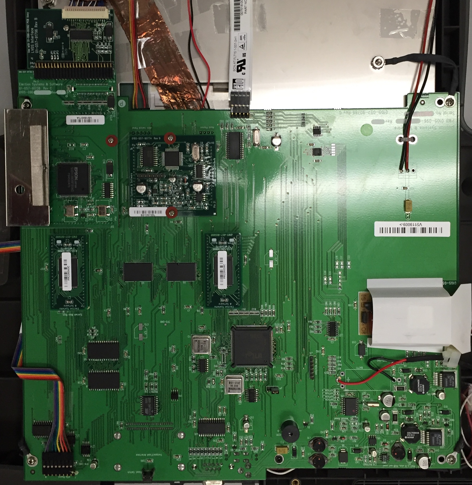

# ES&S iVotronic Voting Machine

The iVotronic DRE voting machine is a touchscreen-equipped voting machine designed by ES&S. It was of interest to our Capstone Project because it is currently (as of 2015) the *only* voting machine used in the state of South Carolina. We aim to document the hardware and software of the machine for the purposes of eventually developing attack vectors.

## What's included

 - `code/` :: C++ JTAG program loader code for an i386EX dev-board, ripped out of a JTAG manual from 1995.
 - `datasheets/` :: Datasheets for all known ICs on the iVotronic board(s). Submodules and daughterboards have their own folders.
 - `pics/` :: Photos of the iVotronic board(s).

## Board photos

This is a shot of the full iVotronic board. There is some glare from the overhead lighting in the room, but all of the ICs should be clearly visible.

