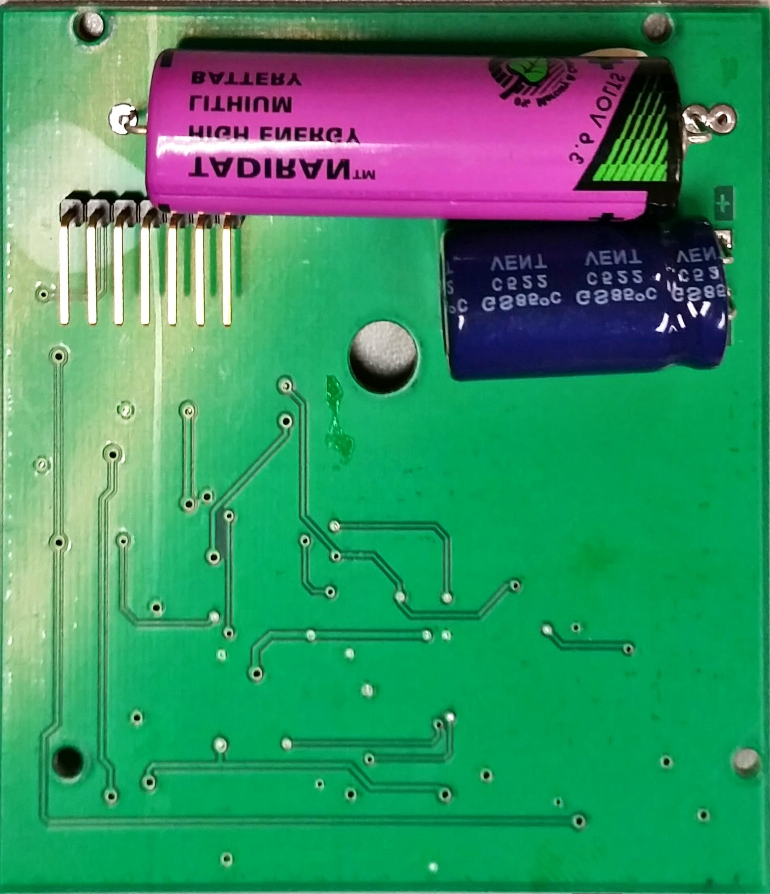

# Portable Electronic Ballot unit

The Portable Electronic Ballot units are used to transport data to and from the iVotronic voting machines. Specialized PEB units can be used to configure iVotronic units and open polls on election day.

## What's included

 - `datasheets` :: Datasheets for the ICs present on the PEB board.
 - `hexdumps` :: Intel-format hex dumps of the PEB memories, along with their binary representations.
 - `info` :: A folder where we stored photos of our notes. These may not make any sense out of context.
 - `pics` :: Photos of the PEB board.

This is the directory where all things related to the PEB (Personal Electornic Ballot) are located. Pictures, notes, and ROM dump(s) are be located here.

## Board photos

The front side of the PEB. All of the ICs are mounted on this side.

The back side of the PEB. The connector pins are visible, as well as the battery.

